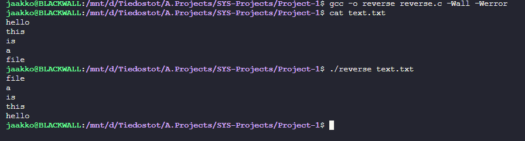
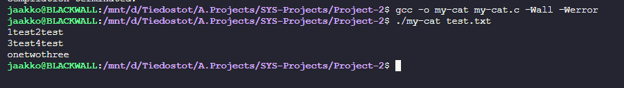
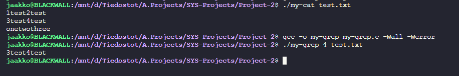
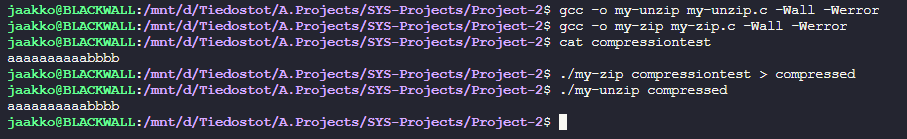
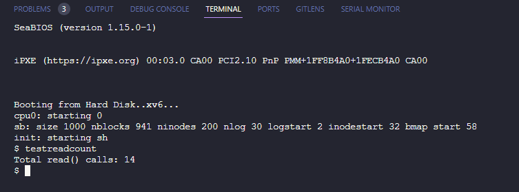

# SYS-Projects 1, 2 & 4

Code available at: [https://github.com/JaakkoLipp/SYS-Projects](https://github.com/JaakkoLipp/SYS-Projects)

Screenshots of programs functionality in screenshots folder.

### 1. Reverse.c

**Usage**

Run the program in a linux terminal with the following syntax:

```bash
reverse <file>
```

- `<file>` is the name of the input file to be line-reversed.

**Error Handling**

- Checks if the input file and output file are the same
- Checks if files cannot be opened
- Checks if memory allocation fails
- Checks if program is given correct arguments

**Functionality**

Program starts by checking command-line arguments and opening the input file. Then it reads lines from the input file into a dynamic array, resizing the array as needed.

If an output file is specified, it opens the output file with writing mode. It then writes lines from the array to output file in reverse order, or to stdout if no output file is given. At the end it frees the memory allocated for the array and closes the output file if it is open.

**Memory Management**

Dynamic memory allocation is used. It starts with an array of a certain size and doubles the size of the array whenever it becomes full. It also uses dynamic memory allocation to store each line of text, resizing the buffer as needed to accommodate long lines.

When the program has finished writing the lines to the output file, it frees the memory allocated for each line and for the array itself.

**Screenshot**



### 2. Unix-Utils

**Usage**

```bash
my-cat [file ...]
```

- `[file ...]`: One or more files to concatenate and display. If no files are provided, `my-cat` performs a no-op.

```bash
my-grep searchterm [file ...]
```

- `searchterm`: The string to search for within each file or stdin.
- `[file ...]`: One or more files to search. If no files are provided, `my-grep` searches stdin.

```bash
my-zip <file1> [file2 ...] > output.z
```

- `<file1> [file2 ...]` One or more files to compress.
- The output is binary and should be redirected to a file (e.g., `output.z`).

```
my-unzip input.z > output.txt
```

- Replace `input.z` with the name of the compressed file.
- The output is text and can be redirected to a file (e.g., `output.txt`).

**Functionality**

my-cat:

The program iterates over each argument provided to it, treating each as a filename to be opened and read. For each file, it reads and prints the content using a buffer of fixed size (`1024` bytes). It reads each file line by line and displays the text on the screen. In case a file cannot be opened, it prints an error message and exits with a non-zero status code, indicating failure.

my-grep:

When given a search term and files, it looks through each file, line by line, for the term. If it finds the term, it prints that line. If it can’t open a file, it gives an error and stops. The program searches standard input if no files are provided. After searching, it cleans up by freeing any used memory.

my-zip:

My-zip compresses files specified as command-line arguments using run-length encoding. It processes each file sequentially by reading characters, tracking consecutive occurrences of each character, and then writing the count and the character itself to the standard output. Error handling is provided for failure to open files and for improper usage.

my-unzip:

My-unzip is a reversal tool for my-zip. It reads each file in arguments and decompresses the content. For each file, it reads pairs of integers and characters, indicating the count of how many times the character should be repeated, and prints the uncompressed data to the standard output. Error handling is provided for failure to open files and for improper usage.

**Screenshots**







### 4. Modified XV6 Kernel

Added new syscall `getreadcount`, which returns the number of times the `read()` system call has been invoked by user processes since the kernel was booted.
**Implementation**

- Added a global counter variable `uint readcount` in `file.c` to keep track of `read()` calls.
- Modified read function to increment `readcount` with each `read()` call in `file.c`.
- Implemented the `sys_getreadcount` function in `sysproc.c` to return current value of `readcount`.
- Assigned a unique identifier to the new system call in `syscall.h` and updated the syscall table in `syscall.c`.
- Declared `getreadcount()` in `user.h` to make the system call accessible from user-space programs.

**Testing**

- Developed a test program `testreadcount` to execute several `read()` operations followed by a `getreadcount()` call. The program then prints the result to verify the accurate incrementation of the counter.
- The modified kernel can be compiled using `make clean` followed by `make` or `make qemu-nox` for testing (Note: `qemu` is required).
- Confirmed to function correctly when tested in `qemu` inside Ubuntu host

**Screenshot**



**Disclaimers**

All programs have been tested to compile and work with -Wall -Werror in gcc, Ubuntu 22.04.3.
Generative AI was used as a teaching tool, and to improve documentation and improve original code structure.
