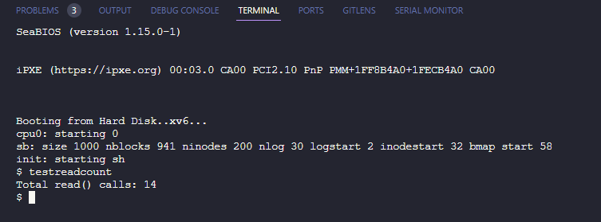

# Käyttöjärjestelmät ja systeemiohjelmointi

- Ideally the documentation would be in seperate files, but "Projektit 1-5 samaan pdf-tiedostoon"

# Project 1: Warmup to C and Unix programming

## Overview

`reverse.c` reads lines from an input file, stores them in a dynamic array, and then writes them to an output file in reverse order. If no output file is provided, it prints the lines to the standard output.

## Usage

Run the program in a linux terminal with the following syntax:

```
reverse <input> <output>
```

Where:

- `<input>` is the name of the input file.
- `<output>` is the name of the output file (optional).

## Error Handling

The program includes the following error handling:

- If the input file and output file are the same, it prints an error message "Input and output file must differ" and exits with return code 1.
- If the user specifies an input file or output file that cannot be opened, it prints an error message "error: cannot open file 'filename'" and exits with return code 1.
- If `malloc()` fails to allocate memory, it prints the error message "malloc failed" and exits with return code 1.
- If the user runs the program with too many arguments, it prints "usage: reverse <input> <output>" and exits with return code 1.

All error messages are printed to `stderr` rather than `stdout`.

## Code Structure

The program begins by checking the command-line arguments and opening the input file. It then reads lines from the input file into a dynamic array, resizing the array as needed.

If an output file is specified, it opens the output file for writing. It then writes the lines from the array to the output file in reverse order, or to `stdout` if no output file is specified.

Finally, it frees the memory allocated for the array and closes the output file if it is open.

## Memory Management

The program uses dynamic memory allocation to store the lines from the input file. It starts with an array of a certain size and doubles the size of the array whenever it becomes full. It also uses dynamic memory allocation to store each line of text, resizing the buffer as needed to accommodate long lines.

When the program has finished writing the lines to the output file, it frees the memory allocated for each line and for the array itself. This ensures that the program does not leak memory, even if the input file is very large.

---

# Project 2: Unix Utilities Page

# my-cat.c

## Overview

The `my-cat` program is a simple implementation similar to the Unix `cat` utility. It concatenates and displays the content of one or more files to the standard output. If no files are specified, the program exits without doing anything, effectively performing a no-operation (no-op).

## Usage

```plaintext
my-cat [file ...]
```

- `[file ...]`: Optional. One or more files to concatenate and display. If no files are provided, `my-cat` performs a no-op.

## Compilation

To compile the `my-cat` program, use the following gcc command:

```bash
gcc -o my-cat my-cat.c
```

This command compiles the source code into an executable named `my-cat`.

## Functionality

The main functionalities of the `my-cat` program include:

- **No Files Specified**: If invoked without any file arguments, the program exits immediately with a return code of `0`, performing no actions.
- **Reading and Displaying File Contents**: For each file specified in the command line arguments, the program attempts to open the file and read its content. The content is then printed to the standard output (`stdout`).
- **Error Handling**: If a file cannot be opened, an error message `my-cat: cannot open file` is printed to the standard output, and the program exits with a return code of `1`.

## Examples

To display the content of a single file:

```bash
./my-cat file1.txt
```

To concatenate and display the contents of multiple files:

```bash
./my-cat file1.txt file2.txt file3.txt
```

## Error Messages

- If the program fails to open a file, it prints `my-cat: cannot open file` to the standard output and exits with a return code of `1`.

## Exit Codes

- `0`: Program executed successfully, all specified files were opened, and their contents displayed.
- `1`: Program encountered an error, such as failure to open a specified file.

## Implementation Details

- The program iterates over each argument provided to it, treating each as a filename to be opened and read.
- For each file, it reads and prints the content using a buffer of fixed size (`1024` bytes). This size is a compromise between memory usage and performance but might not be optimal for all situations.
- It uses the standard C library functions `fopen`, `fgets`, and `fclose` for file operations.
- In case a file cannot be opened, it prints an error message and exits with a non-zero status code, indicating failure.

## Notes

- The buffer size of `1024` bytes is chosen arbitrarily and may not be optimal for all files or systems. Adjustments might be necessary for handling very large lines or optimizing performance.
- The program does not support reading from standard input (stdin) if no files are provided, differing from the traditional Unix `cat` command in this aspect.

# my-grep.c

## Overview

The `my-grep` program is a simplified version of the Unix `grep` utility. It searches for lines containing a specified search term in one or more files and prints those lines to the standard output. If no file is provided, `my-grep` reads from standard input (stdin), allowing it to be used in a pipeline of commands.

## Usage

```plaintext
my-grep searchterm [file ...]
```

- `searchterm`: The string to search for within each file or stdin.
- `[file ...]`: Optional. One or more files to search. If no files are provided, `my-grep` searches stdin.

## Compilation

To compile the `my-grep` program, use the following command:

```bash
gcc -o my-grep my-grep.c
```

## Functionality

The program consists of two main parts: the `grep` function and the `main` function.

### grep Function

```c
void grep(FILE *f, char *searchterm);
```

- **Purpose**: Searches a single file (or stdin) for lines containing the specified search term and prints those lines.
- **Parameters**:
  - `FILE *f`: A file pointer to the file being searched. Can also be stdin.
  - `char *searchterm`: The string to search for in the file's content.
- **Implementation Details**:
  - Reads the file line by line.
  - Uses `strstr` to search for the `searchterm` in each line.
  - If `searchterm` is found, the line is printed to stdout.

### Main Function

The `main` function processes command-line arguments, handles file opening and closing, and calls the `grep` function accordingly.

- **Command-Line Arguments**:
  - The first argument after the program name is considered the `searchterm`.
  - Any subsequent arguments are treated as filenames to be searched.
- **Behavior**:
  - If no arguments are provided, it prints usage information and exits.
  - If only `searchterm` is provided (i.e., `argc == 2`), it reads from stdin.
  - If one or more filenames are provided, it opens and searches each file for the `searchterm`.
- **Error Handling**:
  - If a file cannot be opened, it prints an error message and exits.

## Examples

Search for the term "error" in a file named "log.txt":

```bash
./my-grep error log.txt
```

Search for the term "foo" across multiple files:

```bash
./my-grep foo file1.txt file2.txt
```

Use in a pipeline to search for "hello" in the output of another command:

```bash
echo -e "hello\nworld" | ./my-grep hello
```

## Error Messages

- If the program is invoked without a search term, it will display: `my-grep: searchterm [file ...]` and exit.
- If a specified file cannot be opened, it will display: `my-grep: cannot open file` and exit.

## Exit Codes

- `0`: Program executed successfully.
- `1`: Program encountered an error, such as missing arguments or unable to open a file.

# ZIP and UNZIP Utilities

This repository contains two utility programs for simple file compression and decompression using run-length encoding (RLE). RLE is a form of lossless data compression in which runs of data are stored as a single data value and count.

## Programs

- `my-zip`: Compresses one or more text files using RLE, producing a binary output of 4-byte integers followed by a single character, indicating the count and the character respectively.
- `my-unzip`: Decompresses files that were compressed with `my-zip`, restoring them to their original state.

## Getting Started

### Prerequisites

- A C compiler such as GCC
- Make (optional for easier compilation)

### Compilation

You can compile both programs with the following commands:

```sh
gcc -o my-zip my-zip.c
gcc -o my-unzip my-unzip.c
```

### Usage

To compress files with `my-zip`, redirect the output to a file as follows:

```sh
./my-zip input1.txt [input2.txt ...] > output.z
```

To decompress a file with `my-unzip`, you can use:

```sh
./my-unzip output.z
```

## Implementation Details

- `my-zip` reads through the input file(s) and compresses them using run-length encoding. The output is a binary format where each 5-byte block contains a 4-byte integer (representing the count of repeated characters) followed by the single repeated character.
- `my-unzip` reads the binary compressed file and decompresses it, effectively reversing the process performed by `my-zip`.

## Example

Given a file `example.txt` containing:

```
aaaaabbbcccdde
```

Compressing it with `my-zip` and then decompressing with `my-unzip` will produce:

```
aaaaabbbcccdde
```

---

# Project 4: Modified XV6 Kernel with New Syscall `getreadcount`

## Overview

This project introduces a modified XV6 kernel that implements a new syscall, `getreadcount`. This syscall returns the number of times the `read()` system call has been invoked by user processes since the kernel was booted.

## Location

The modified kernel can be explored and tested within the `kernel` folder inside Project 4.

## Purpose

The purpose of adding the `getreadcount` system call is to monitor the usage of the `read()` system call, providing insights into read operations performed by user processes.

## Implementation Summary

### Adding `getreadcount` System Call to XV6

- **Global Counter**: Introduced a global variable `uint readcount` to keep track of `read()` invocations.
- **Modifying `read` Function**: The `readcount` is incremented within the `read()` function to reflect each invocation.
- **System Call Implementation**: Implemented the `sys_getreadcount` function to return the current value of `readcount`.
- **System Call Registration**: Assigned a unique identifier to the new system call and updated the syscall table in `syscall.c` to include it.
- **User Space Accessibility**: Made `getreadcount()` accessible to user programs by declaring it in `user.h`.

## Testing

- Developed a test program `testreadcount` to execute several `read()` operations followed by a `getreadcount()` call. The program then prints the result to verify the accurate incrementation of the counter.
- The project can be compiled using `make clean` followed by `make` or `make qemu-nox` for execution (Note: `qemu` is required).
- Confirmed to function correctly when tested in a `qemu`/Ubuntu host environment.

## Screenshot



This screenshot showcases the output of the `testreadcount` program, demonstrating the functionality of the new `getreadcount` syscall.

---

#### disclaimers and sources

All programs have been tested to compile and work with -Wall -Werror in gcc.
Generative AI was used to generate and improve parts of the documentation, and to refine and improve code readability and structure.
AI was used as a teaching tool and some information may be based on AI generated content.
